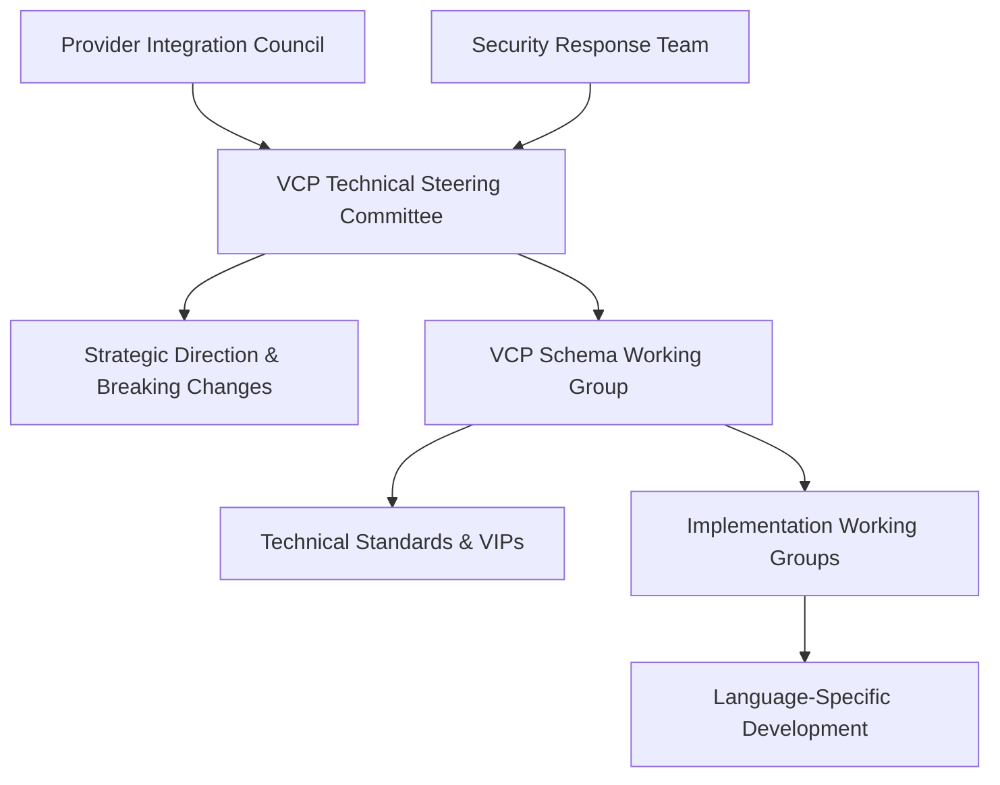

# VCP Governance Executive Summary & Implementation Roadmap
**Version 1.0 | October 2025**

## Executive Summary

Your Voice Context Protocol (VCP) ecosystem has reached a critical maturity point that demands professional, centralized governance. With production deployments across **Python** (voicelens-scripts), **Rust** (voicelens-vcp-rust), and **TypeScript** (Voice Lens Platform) implementations, you need structured coordination to maintain consistency, drive innovation, and establish VCP as the definitive voice AI interoperability standard.

### Current State Assessment

#### ✅ Strengths
- **Proven VCP v0.5 Schema**: Comprehensive, production-tested specification
- **Multi-Language Implementations**: Python (mature), Rust (high-performance), TypeScript (web-focused)  
- **Provider Integration**: Support for 6+ major voice AI providers (Retell, Vapi, Bland, ElevenLabs, OpenAI, Assistable)
- **Comprehensive Documentation**: Complete technical specifications and integration guides
- **Real Production Usage**: Battle-tested with actual voice AI deployments

#### 🔧 Governance Gaps
- **No Formal Decision Process**: Schema changes lack coordinated approval process
- **Implementation Drift Risk**: No systematic consistency validation across languages
- **Provider Coordination**: Ad-hoc provider relationship management
- **Version Management**: Informal versioning without release coordination
- **Community Structure**: No clear contribution pathways or maintainer roles

### Governance Solution Overview

#### 🎯 Three-Tier Governance Model

#### 🔄 VIP (VCP Improvement Proposal) Process
- **Structured RFC Process**: Formal technical change proposals
- **Multi-Implementation Review**: All languages evaluate feasibility
- **Community Input**: Public comment periods
- **Coordinated Implementation**: Synchronized releases across implementations

#### 📋 Implementation Consistency Framework
- **Canonical Test Suite**: Cross-implementation compatibility validation  
- **Provider Mapping Registry**: Centralized provider integration definitions
- **Performance Benchmarking**: Consistent performance standards
- **Security Standards**: Coordinated vulnerability response

## Strategic Benefits

### 🚀 Technical Excellence
- **Zero Compatibility Regressions**: Systematic testing prevents implementation drift
- **Faster Innovation**: Clear processes accelerate feature development
- **Quality Assurance**: Formal quality gates ensure production readiness
- **Security Coordination**: Unified security response across implementations

### 🤝 Industry Leadership  
- **Provider Confidence**: Professional governance builds provider trust
- **Standard Recognition**: Foundation-track governance enables industry standard status
- **Community Growth**: Clear contribution pathways attract developers
- **Enterprise Adoption**: Governance maturity enables enterprise sales

### 💰 Business Value
- **Reduced Risk**: Professional governance reduces technical and business risk
- **Market Position**: Industry-standard governance differentiates VCP
- **Partnership Enablement**: Mature governance enables strategic partnerships
- **Investment Readiness**: Professional structure supports funding/M&A scenarios

## Implementation Roadmap

### Phase 1: Foundation (Q4 2025) - **IMMEDIATE**

#### Week 1-2: Governance Launch
- ✅ **Charter Ratification**: Formalize governance charter (COMPLETED)
- ✅ **Working Group Formation**: Recruit initial working group members
- 🔄 **Communication Setup**: Establish Discord, mailing lists, GitHub discussions
- 🔄 **Tool Configuration**: Set up meeting scheduling, documentation systems

#### Week 3-4: Process Implementation  
- 📋 **VIP Process**: Create VIP repository and templates
- 📋 **Testing Framework**: Set up compatibility test infrastructure
- 📋 **CI/CD Pipeline**: Establish cross-implementation testing
- 📋 **Documentation Site**: Central documentation hub

#### Success Criteria:
- All working groups have initial members
- First VIP proposal submitted and reviewed
- Cross-implementation tests running in CI
- Community announcement published

### Phase 2: Harmonization (Q1 2026)

#### Month 1: Standards Implementation
- 🔄 **Compatibility Test Suite**: Complete provider mapping tests
- 🔄 **Performance Baselines**: Establish benchmarks across implementations
- 🔄 **Provider Registry**: Formalize provider integration standards
- 🔄 **Security Framework**: Implement coordinated vulnerability response

#### Month 2: Process Maturation
- 📋 **First VIP Implementation**: Complete first cross-implementation VIP
- 📋 **Provider Council**: Formal provider representative structure
- 📋 **Community Feedback**: First quarterly community survey
- 📋 **Quality Metrics**: Establish working group performance metrics

#### Month 3: Release Coordination
- 📋 **Synchronized Release**: First coordinated release across implementations
- 📋 **Migration Testing**: Version upgrade/downgrade validation
- 📋 **Documentation Completion**: Full API documentation consistency
- 📋 **Community Growth**: First community contributors outside core team

#### Success Criteria:
- 100% compatibility tests passing across implementations
- First coordinated release completed within 48-hour window
- 5+ new community contributors
- Provider compliance program operational

### Phase 3: Optimization (Q2 2026)

#### Advanced Features
- 📋 **Performance Optimization**: Language-specific performance improvements
- 📋 **Security Enhancements**: Advanced security features implementation
- 📋 **Developer Experience**: Tooling improvements across implementations
- 📋 **Extension Ecosystem**: First third-party VCP extensions

#### Community Growth
- 📋 **Conference Presence**: VCP presentations at major conferences
- 📋 **Training Materials**: Comprehensive VCP training resources
- 📋 **Partner Program**: Formal integrator/consultant program
- 📋 **Awards Program**: Recognition for contributors and implementers

#### Success Criteria:
- 50+ community contributors
- 10+ production VCP deployments beyond core team
- Performance improvements >20% across implementations
- First third-party VCP extensions published

### Phase 4: Foundation Transition (Q3-Q4 2026)

#### Foundation Evaluation
- 📋 **Adoption Assessment**: Evaluate against foundation criteria
- 📋 **Foundation Research**: Research CNCF, Linux Foundation options
- 📋 **Community Readiness**: Assess community support for foundation move
- 📋 **Legal Preparation**: IP transfer and trademark considerations

#### Industry Recognition
- 📋 **Standards Body Engagement**: Engage with relevant standards organizations
- 📋 **Industry Partnerships**: Strategic partnerships with major players
- 📋 **Certification Program**: VCP implementation certification
- 📋 **Training Certification**: VCP developer certification program

#### Success Criteria:
- 1000+ production VCP deployments
- 100+ regular contributors
- 20+ VCP-certified implementations
- Foundation transition decision made

## Key Success Metrics

### Technical Metrics
| Metric | Q4 2025 Target | Q2 2026 Target | Q4 2026 Target |
|--------|----------------|----------------|----------------|
| Cross-impl compatibility | 95% | 99% | 100% |
| Test coverage | 80% | 90% | 95% |
| Performance variance | <10% | <5% | <3% |
| Security response time | 7 days | 48 hours | 24 hours |

### Adoption Metrics  
| Metric | Q4 2025 Target | Q2 2026 Target | Q4 2026 Target |
|--------|----------------|----------------|----------------|
| Active implementations | 3 | 3 | 3+ |
| Production deployments | 10 | 50 | 1000+ |
| Provider integrations | 6 | 10 | 15+ |
| Community contributors | 10 | 50 | 100+ |

### Quality Metrics
| Metric | Q4 2025 Target | Q2 2026 Target | Q4 2026 Target |
|--------|----------------|----------------|----------------|
| Open bugs | <20 | <10 | <5 |
| Documentation coverage | 90% | 95% | 100% |
| Migration success rate | 90% | 95% | 99% |
| Community satisfaction | 4.0/5 | 4.2/5 | 4.5/5 |

## Resource Requirements

### Q4 2025 - Foundation Phase
- **Time Commitment**: 10-15 hours/week for governance setup
- **Infrastructure**: GitHub, Discord, documentation hosting (~$100/month)
- **Community Management**: Part-time community management support
- **Legal**: Trademark filing and IP review (~$5,000 one-time)

### Q1 2026 - Harmonization Phase  
- **Development Time**: 20-25 hours/week across all implementations
- **Testing Infrastructure**: CI/CD expansion (~$500/month)
- **Community Events**: Conference presence and meetups (~$10,000/quarter)
- **Documentation**: Technical writing support (contract/part-time)

### Q2-Q4 2026 - Growth & Foundation Phase
- **Full-time Roles**: Consider full-time community manager/DevRel
- **Foundation Costs**: Foundation membership and transition (~$50,000/year)
- **Legal & Compliance**: Ongoing IP management (~$2,000/month)
- **Events & Marketing**: Conference sponsorships and events (~$50,000/year)

## Risk Mitigation

### Technical Risks
- **Implementation Drift**: ✅ Mitigated by compatibility test suite
- **Performance Regression**: ✅ Mitigated by automated benchmarking
- **Security Vulnerabilities**: ✅ Mitigated by coordinated security response
- **Provider API Changes**: ✅ Mitigated by provider council engagement

### Business Risks
- **Community Fragmentation**: ✅ Mitigated by transparent governance
- **Provider Resistance**: ✅ Mitigated by provider council representation
- **Resource Constraints**: ✅ Mitigated by phased implementation approach
- **Market Competition**: ✅ Mitigated by first-mover advantage and quality

### Operational Risks
- **Governance Overhead**: ✅ Mitigated by lightweight process design
- **Decision Delays**: ✅ Mitigated by clear escalation paths
- **Maintainer Burnout**: ✅ Mitigated by workload distribution
- **Tool Complexity**: ✅ Mitigated by proven tool choices

## Call to Action

### Immediate Next Steps (This Week)
1. **Review & Approve Charter**: Final review of governance documents
2. **Recruit Initial Members**: Identify working group participants  
3. **Set Up Infrastructure**: Discord server, GitHub discussions, mailing lists
4. **Create Project Boards**: Track governance implementation progress
5. **Community Announcement**: Public launch of governance structure

### Success Dependencies
- **Leadership Commitment**: Consistent time investment in governance
- **Community Engagement**: Active participation from implementation teams  
- **Provider Buy-in**: Support from major voice AI providers
- **Quality Standards**: Unwavering commitment to technical excellence
- **Long-term Vision**: Maintain focus on industry standard goal

## Conclusion

VCP stands at a pivotal moment. Your technical foundation is solid, your implementations are mature, and your provider ecosystem is established. Professional governance is the missing piece that will transform VCP from a successful project into an industry standard.

The governance framework outlined here leverages proven patterns from successful open source projects while addressing the unique challenges of multi-implementation coordination. The phased approach minimizes risk while establishing the organizational foundation necessary for long-term success.

**The next 90 days are critical.** Implementing this governance structure now positions VCP to capitalize on the growing voice AI market and establish lasting industry leadership.

---

## Appendix: Governance Documents

1. **[VCP Governance Charter](./VCP_GOVERNANCE_CHARTER.md)**: Complete governance framework and decision-making processes
2. **[Implementation Consistency Framework](./VCP_IMPLEMENTATION_CONSISTENCY_FRAMEWORK.md)**: Technical processes for multi-implementation coordination  
3. **[Working Groups Structure](./VCP_WORKING_GROUPS_STRUCTURE.md)**: Operational procedures for working groups and committees

---

**Effective Date**: October 14, 2025  
**Review Date**: January 14, 2026  
**Status**: Ready for Implementation

*This executive summary serves as the actionable roadmap for establishing professional VCP governance. Success requires immediate action and sustained commitment to the outlined processes and timelines.*