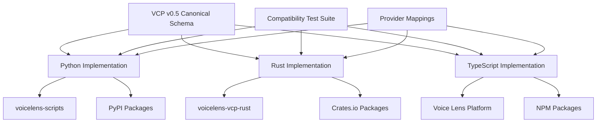
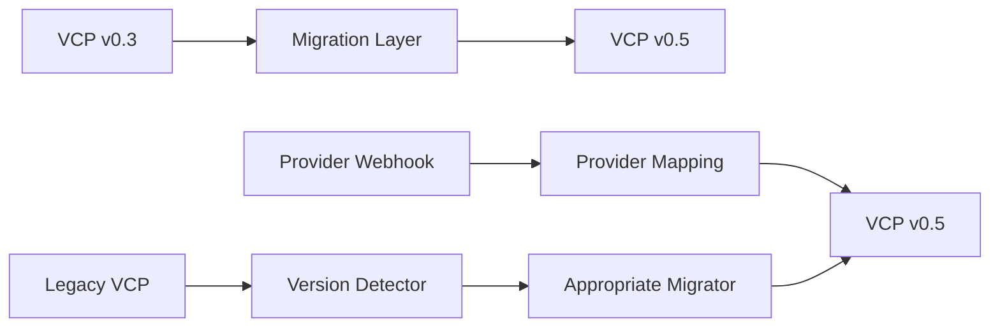

# VCP Implementation Consistency Framework
**Version 1.0 | October 2025**

## Overview

This framework ensures consistent behavior, compatibility, and coordinated evolution across all VCP implementations (Python, Rust, TypeScript) while enabling language-specific optimizations. It defines the technical processes, testing requirements, and quality gates that maintain VCP's integrity as a cross-platform standard.

## 1. Multi-Implementation Architecture

### 1.1 Implementation Ecosystem


### 1.2 Implementation Responsibilities

#### Python Implementation (voicelens-scripts)
- **Role**: Production reference implementation
- **Strengths**: Provider integrations, operational maturity
- **Responsibilities**:
  - VCP schema evolution prototyping
  - Provider mapping validation
  - Production deployment patterns
  - Migration tooling

#### Rust Implementation (voicelens-vcp-rust)  
- **Role**: High-performance, type-safe implementation
- **Strengths**: Memory safety, performance, concurrency
- **Responsibilities**:
  - Performance benchmarking baseline
  - Type system validation
  - WebAssembly compilation targets
  - Security-critical deployments

#### TypeScript Implementation (Voice Lens Platform)
- **Role**: Web-first, developer-friendly implementation
- **Strengths**: Browser compatibility, npm ecosystem
- **Responsibilities**:
  - Web platform integrations
  - Developer experience optimization
  - Frontend/backend compatibility
  - JavaScript ecosystem bridge

## 2. Schema Synchronization Process

### 2.1 Schema Change Propagation
```bash
# Schema Evolution Workflow
1. VCP Schema Change (VIP approved)
   ├── Python: Update pydantic models
   ├── Rust: Update serde structs  
   └── TypeScript: Update TypeScript interfaces

2. Compatibility Validation
   ├── Cross-implementation test execution
   ├── Provider mapping verification
   └── Migration path testing

3. Coordinated Release
   ├── Implementation-specific releases
   ├── Documentation updates
   └── Community notification
```

### 2.2 Schema Consistency Requirements

#### Core Schema Elements:
```json
{
  "vcp_version": "0.5",
  "vcp_payload": {
    "call": { /* identical structure across implementations */ },
    "model_selection": { /* identical structure */ },
    "outcomes": { /* identical structure */ },
    "hcr": { /* identical structure */ },
    "artifacts": { /* identical structure */ }
  },
  "audit": { /* identical structure */ }
}
```

#### Implementation-Specific Optimizations:
- **Python**: Pydantic field validators and custom serializers
- **Rust**: Custom serde deserializers and compile-time validation
- **TypeScript**: Branded types and runtime type guards

## 3. Compatibility Test Suite

### 3.1 Test Suite Architecture
```
vcp-compatibility-tests/
├── schema/
│   ├── validation/           # Schema validation tests
│   ├── serialization/        # JSON serialization tests
│   └── migration/           # Version migration tests
├── fixtures/
│   ├── golden/              # Golden test files
│   ├── provider-samples/    # Real provider webhook samples
│   └── edge-cases/         # Edge case test data
├── provider-mappings/
│   ├── retell/             # Retell AI specific tests
│   ├── vapi/               # Vapi specific tests
│   ├── bland/              # Bland AI specific tests
│   ├── elevenlabs/         # ElevenLabs specific tests
│   └── openai/             # OpenAI Realtime specific tests
├── performance/
│   ├── benchmarks/         # Performance benchmark tests
│   └── memory/             # Memory usage tests
└── integration/
    ├── cross-impl/         # Cross-implementation tests
    └── e2e/               # End-to-end workflow tests
```

### 3.2 Test Categories

#### Schema Validation Tests
```python
# Example test structure
def test_vcp_message_validation():
    """Ensure all implementations validate VCP messages identically"""
    test_message = load_fixture("valid_vcp_message.json")
    
    # All implementations must produce identical validation results
    python_result = python_validator.validate(test_message)
    rust_result = rust_validator.validate(test_message)  
    typescript_result = typescript_validator.validate(test_message)
    
    assert python_result.is_valid == rust_result.is_valid == typescript_result.is_valid
    assert python_result.errors == rust_result.errors == typescript_result.errors
```

#### Provider Mapping Tests
```python
def test_provider_webhook_mapping():
    """Ensure all implementations map provider webhooks identically"""
    webhook_payload = load_fixture("retell_webhook.json")
    
    python_vcp = python_mapper.map_to_vcp("retell", webhook_payload)
    rust_vcp = rust_mapper.map_to_vcp("retell", webhook_payload)
    typescript_vcp = typescript_mapper.map_to_vcp("retell", webhook_payload)
    
    # VCP output must be functionally identical (ignoring serialization differences)
    assert normalize_vcp(python_vcp) == normalize_vcp(rust_vcp) == normalize_vcp(typescript_vcp)
```

#### Migration Tests  
```python
def test_version_migration():
    """Ensure all implementations migrate versions identically"""
    v03_message = load_fixture("vcp_v03_message.json")
    
    python_v05 = python_migrator.upgrade_to_v05(v03_message)
    rust_v05 = rust_migrator.upgrade_to_v05(v03_message)
    typescript_v05 = typescript_migrator.upgrade_to_v05(v03_message)
    
    assert normalize_vcp(python_v05) == normalize_vcp(rust_v05) == normalize_vcp(typescript_v05)
```

### 3.3 Performance Benchmarks
```yaml
# Performance requirements across implementations
benchmarks:
  schema_validation:
    minimum_throughput: 10000 # messages/second
    max_latency_p99: 10       # milliseconds
    
  provider_mapping:
    minimum_throughput: 5000  # webhooks/second
    max_latency_p99: 20       # milliseconds
    
  serialization:
    minimum_throughput: 50000 # messages/second
    max_latency_p99: 2        # milliseconds

performance_baselines:
  python: "baseline implementation"
  rust: "2-10x faster than Python"
  typescript: "within 50% of Python performance"
```

## 4. Continuous Integration Matrix

### 4.1 CI Pipeline Architecture
```yaml
# .github/workflows/vcp-compatibility.yml
name: VCP Cross-Implementation Compatibility

on: [push, pull_request]

jobs:
  compatibility-tests:
    runs-on: ubuntu-latest
    strategy:
      matrix:
        implementation: [python, rust, typescript]
        test-suite: [schema, provider-mappings, migration, performance]
    
    steps:
      - name: Setup Implementation Environment
      - name: Run Test Suite
      - name: Upload Results
      - name: Cross-Implementation Comparison
```

### 4.2 Quality Gates

#### Pre-Merge Requirements:
- ✅ All schema validation tests pass (100%)
- ✅ All provider mapping tests pass (100%)  
- ✅ Migration tests pass (100%)
- ✅ Performance benchmarks within acceptable range
- ✅ Cross-implementation compatibility verified
- ✅ Documentation updated

#### Release Requirements:
- ✅ Full compatibility test suite passes
- ✅ Integration tests with real provider data
- ✅ Performance regression analysis
- ✅ Security vulnerability scans
- ✅ Documentation completeness check

## 5. Provider Integration Consistency

### 5.1 Provider Mapping Registry
```typescript
// Centralized provider mapping definitions
interface ProviderMapping {
  provider: string;
  version: string;
  mappings: {
    [vcpField: string]: {
      path: string;              // JSONPath to provider field
      transform?: string;        // Transformation function name
      required: boolean;         // Whether field is required
      validation?: string;       // Validation rules
    };
  };
  custom_fields: {
    [customField: string]: any; // Provider-specific extensions
  };
}

// Example: Retell AI mapping
const retellMapping: ProviderMapping = {
  provider: "retell",
  version: "1.0",
  mappings: {
    "call.call_id": { path: "call.call_id", required: true },
    "call.duration_sec": { path: "call.duration", required: true },
    "call.direction": { 
      path: "call.direction", 
      transform: "normalizeDirection",
      required: false 
    }
  },
  custom_fields: {
    "custom.provider_specific.retell.channel": "call.channel"
  }
};
```

### 5.2 Transformation Functions
```python
# Shared transformation logic (implemented in each language)
class VCPTransformations:
    @staticmethod
    def normalize_direction(value: str) -> CallDirection:
        """Normalize provider direction to VCP CallDirection enum"""
        direction_map = {
            "inbound": CallDirection.INBOUND,
            "outbound": CallDirection.OUTBOUND,
            "incoming": CallDirection.INBOUND,
            "outgoing": CallDirection.OUTBOUND,
        }
        return direction_map.get(value.lower(), CallDirection.INBOUND)
    
    @staticmethod
    def normalize_phone_number(value: str) -> str:
        """Normalize phone numbers to E.164 format"""
        # Implementation must be identical across all languages
        pass
        
    @staticmethod  
    def compute_perception_gap(perceived: List[float], objective: float) -> PerceptionGap:
        """Compute perception gap with identical algorithm"""
        # Implementation must be identical across all languages
        pass
```

## 6. Version Migration Framework

### 6.1 Migration Strategy


### 6.2 Migration Requirements
- **Lossless**: No data lost during version upgrades
- **Deterministic**: Identical results across implementations
- **Reversible**: Ability to downgrade when possible
- **Validated**: Migration results validated against schema

### 6.3 Migration Test Matrix
```yaml
migration_tests:
  v03_to_v05:
    - basic_call_data
    - provider_webhooks  
    - edge_cases
    - malformed_input
    
  v04_to_v05:
    - incomplete_v04_data
    - v04_extensions
    - backward_compatibility
    
  downgrade_tests:
    - v05_to_v03_compatible
    - feature_loss_warnings
    - data_preservation
```

## 7. Development Workflow

### 7.1 Schema Change Process
1. **VIP Proposal**: Technical specification for schema change
2. **Multi-Implementation Impact Assessment**: Each team evaluates impact
3. **Prototype Implementation**: Implement in primary language (Python)
4. **Cross-Implementation Development**: Parallel development in Rust/TypeScript
5. **Compatibility Testing**: Full test suite execution
6. **Community Review**: Public review period
7. **Coordinated Release**: Synchronized releases

### 7.2 Implementation-Specific Changes
1. **Local Development**: Language-specific optimizations and fixes
2. **Compatibility Validation**: Ensure behavior remains consistent
3. **Performance Testing**: Validate performance improvements
4. **Documentation Update**: Update implementation-specific docs
5. **Independent Release**: Can release without coordinating other implementations

## 8. Monitoring and Observability

### 8.1 Compatibility Monitoring
```python
# Automated compatibility monitoring
class CompatibilityMonitor:
    def monitor_implementations(self):
        """Continuous monitoring of implementation behavior"""
        test_cases = self.load_test_cases()
        
        for test_case in test_cases:
            python_result = self.run_python_test(test_case)
            rust_result = self.run_rust_test(test_case)  
            typescript_result = self.run_typescript_test(test_case)
            
            if not self.results_equivalent(python_result, rust_result, typescript_result):
                self.alert_compatibility_issue(test_case, [python_result, rust_result, typescript_result])
```

### 8.2 Performance Monitoring
- **Benchmark Regression Detection**: Alert on >5% performance degradation
- **Memory Usage Tracking**: Monitor memory consumption patterns
- **Throughput Monitoring**: Track processing throughput over time
- **Latency Percentiles**: Monitor p50, p95, p99 latencies

## 9. Error Handling and Debugging

### 9.1 Consistent Error Reporting
```typescript
// Standardized error format across implementations
interface VCPError {
  code: string;           // Standardized error code
  message: string;        // Human-readable message
  field_path?: string;    // JSONPath to problematic field
  provider?: string;      // Provider name if relevant
  implementation: string; // Which implementation generated error
  context: any;          // Additional context
}

// Example error codes (consistent across implementations)
const VCP_ERROR_CODES = {
  SCHEMA_VALIDATION_FAILED: "VCP_E001",
  PROVIDER_MAPPING_FAILED: "VCP_E002", 
  VERSION_MIGRATION_FAILED: "VCP_E003",
  FIELD_TYPE_MISMATCH: "VCP_E004",
  REQUIRED_FIELD_MISSING: "VCP_E005",
};
```

### 9.2 Debug Information
- **Trace IDs**: Unique identifiers for tracking across implementations
- **Debug Logs**: Standardized debug information format
- **Error Context**: Rich context information for troubleshooting
- **Implementation Markers**: Clear identification of which implementation processed data

## 10. Security Consistency

### 10.1 Security Requirements
- **Input Validation**: Identical validation across implementations
- **Provider Signature Verification**: Consistent cryptographic verification
- **Data Sanitization**: Consistent PII/sensitive data handling
- **Error Information Disclosure**: Consistent error information handling

### 10.2 Security Testing
```python
# Security test requirements for all implementations
def test_input_validation_consistency():
    """Ensure all implementations handle malicious input identically"""
    malicious_inputs = load_security_test_vectors()
    
    for malicious_input in malicious_inputs:
        python_response = python_implementation.process(malicious_input)
        rust_response = rust_implementation.process(malicious_input)
        typescript_response = typescript_implementation.process(malicious_input)
        
        # All implementations must reject malicious input in same way
        assert all(response.is_error for response in [python_response, rust_response, typescript_response])
```

## 11. Documentation Consistency

### 11.1 Documentation Requirements
- **API Documentation**: Identical API documentation across implementations
- **Example Code**: Equivalent examples in each language
- **Migration Guides**: Consistent migration instructions
- **Integration Guides**: Provider integration guides for each implementation

### 11.2 Documentation Validation
```bash
# Automated documentation consistency checking
./validate-docs.sh --check-examples --validate-apis --cross-reference
```

## 12. Implementation Timeline

### Phase 1: Foundation (Q4 2025)
- ✅ Establish governance charter
- ✅ Create compatibility test framework
- ✅ Set up CI/CD pipelines
- ✅ Define quality gates

### Phase 2: Harmonization (Q1 2026)  
- 🔄 Implement full compatibility test suite
- 🔄 Establish performance benchmarks
- 🔄 Create provider mapping registry
- 🔄 Set up monitoring systems

### Phase 3: Optimization (Q2 2026)
- 📋 Performance optimization projects  
- 📋 Advanced security features
- 📋 Developer experience improvements
- 📋 Community tooling

### Phase 4: Foundation Transition (Q3-Q4 2026)
- 📋 Evaluate foundation transition
- 📋 Establish neutral governance
- 📋 Community growth initiatives
- 📋 Industry standard recognition

---

## Conclusion

This Implementation Consistency Framework ensures VCP maintains its integrity as a cross-platform standard while enabling each implementation to leverage language-specific advantages. The framework provides the technical rigor necessary for VCP to become the definitive voice AI interoperability protocol.

**Key Success Metrics**:
- 100% compatibility across implementations for core functionality
- <5% performance variance (accounting for language characteristics)
- Coordinated releases within 30 days across implementations
- Zero compatibility regressions post-release

---

*This framework is a living document, evolved through practical experience and community feedback.*