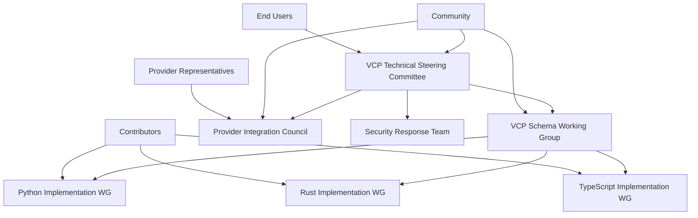
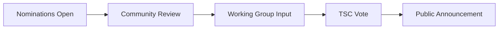
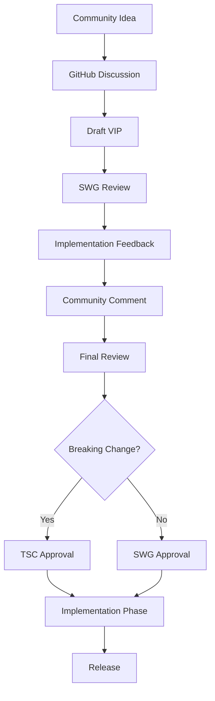
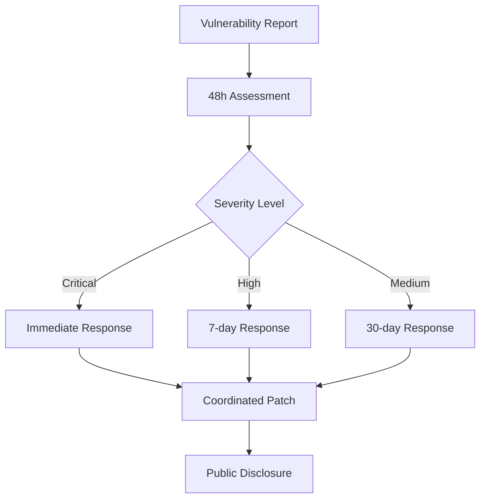
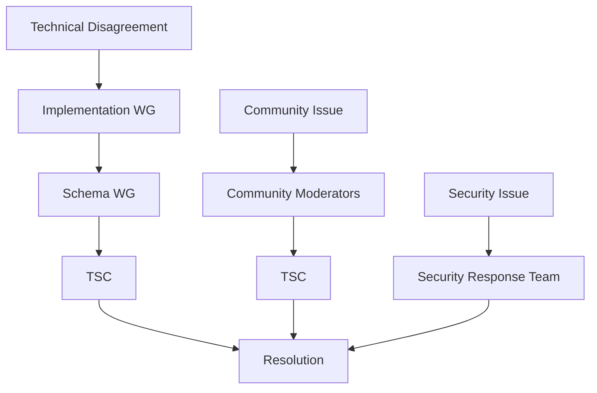

# VCP Working Groups Structure & Operations
**Version 1.0 | October 2024**

## Overview

This document defines the operational structure, procedures, and responsibilities of the VCP (Voice Context Protocol) working groups that govern the multi-implementation ecosystem. It provides the practical framework for coordinating development, ensuring consistency, and making technical decisions across Python, Rust, and TypeScript implementations.

## 1. Organizational Chart



## 2. VCP Technical Steering Committee (TSC)

### 2.1 Charter & Responsibilities
The TSC provides strategic direction, conflict resolution, and final authority on breaking changes and governance decisions.

#### Core Responsibilities:
- **Strategic Direction**: VCP roadmap, major version planning, foundation transition
- **Governance**: Charter amendments, working group oversight, conflict resolution
- **Breaking Changes**: Final approval for VCP major version releases
- **Community Health**: Maintainer sustainability, contributor recognition, code of conduct
- **Legal & IP**: Trademark management, patent policy, licensing decisions

#### Decision-Making Authority:
- ✅ VCP major version releases (0.5 → 1.0)
- ✅ Governance charter changes
- ✅ Working group creation/dissolution  
- ✅ Conflict escalation final decisions
- ✅ Foundation transition approval
- ✅ Security vulnerability response coordination

### 2.2 Composition & Selection

#### Members (7 total):
1. **VCP Specification Lead** (1)
   - Role: Owns canonical schema, coordinates versions
   - Selection: Community nomination + TSC approval
   - Term: 2 years, renewable

2. **Implementation Leads** (3)
   - Roles: Python, Rust, TypeScript implementation maintainers
   - Selection: Implementation working group nomination
   - Term: 2 years, renewable

3. **Community Representatives** (2)
   - Roles: Provider integrators, end-user advocates
   - Selection: Community election (annual)
   - Term: 1 year, renewable (max 3 terms)

4. **Security Officer** (1)
   - Role: Security implications, vulnerability management
   - Selection: TSC appointment
   - Term: 2 years, renewable

#### Selection Process:


### 2.3 Meeting Operations

#### Schedule:
- **Regular Meetings**: First Tuesday of each month, 2:00 PM UTC
- **Emergency Sessions**: Within 48 hours of critical issues
- **Annual Planning**: Full-day strategic planning session

#### Meeting Structure:
1. **Opening** (5 min)
   - Attendance, agenda review
2. **Implementation Reports** (15 min)
   - Status updates from each implementation
3. **Working Group Reports** (15 min)
   - Schema WG, Provider Council updates
4. **Decision Items** (20 min)
   - VIPs requiring TSC approval
5. **Discussion Items** (15 min)
   - Strategic planning, community issues
6. **Closing** (5 min)
   - Action items, next meeting

#### Decision Process:
- **Quorum**: 5 of 7 members required
- **Consensus First**: Attempt consensus on all decisions
- **Voting**: Simple majority (4/7) if consensus not reached
- **Vetoes**: Security Officer has security veto power
- **Records**: All decisions recorded as ADRs (Architecture Decision Records)

## 3. VCP Schema Working Group (SWG)

### 3.1 Purpose & Authority
Technical oversight of VCP specification evolution, ensuring consistency and backward compatibility across all implementations.

#### Core Responsibilities:
- **Schema Evolution**: Review and approve VIPs (VCP Improvement Proposals)
- **Version Management**: Coordinate version releases, migration paths
- **Compatibility**: Ensure cross-implementation compatibility
- **Extension Registry**: Manage VCP extension namespace and approval
- **Technical Standards**: Define implementation requirements and quality gates

#### Decision-Making Authority:
- ✅ VIP approval (non-breaking changes)
- ✅ Extension registry additions
- ✅ Implementation compatibility requirements
- ✅ Technical standard definitions
- ⚠️ Breaking changes (recommend to TSC)

### 3.2 Composition

#### Core Members:
- **Chair**: Elected annually by SWG members
- **Implementation Leads**: Python, Rust, TypeScript leads (ex-officio)
- **Provider Integration Specialists** (2-3): Experts in provider mappings
- **Community Contributors**: Active contributors (as needed)

#### Rotating Participants:
- **Subject Matter Experts**: Invited for specific topics
- **Provider Representatives**: For provider-specific discussions
- **Security Specialist**: For security-related VIPs

### 3.3 VIP (VCP Improvement Proposal) Process

#### VIP Lifecycle:


#### VIP Template:
```markdown
# VIP-XXXX: [Title]

## Summary
Brief description of the proposal

## Motivation  
Why is this change needed?

## Detailed Design
Technical specification

## Rationale and Alternatives
Why this approach over alternatives?

## Backwards Compatibility
Impact on existing implementations

## Reference Implementation
Code examples or pseudo-code

## Unresolved Questions
Open issues for discussion
```

### 3.4 Meeting Operations

#### Schedule:
- **Bi-weekly**: Every other Wednesday, 3:00 PM UTC
- **VIP Reviews**: Special sessions as needed
- **Implementation Sync**: Monthly with all implementation WGs

#### Typical Agenda:
1. **VIP Review Queue** (30 min)
2. **Implementation Status** (15 min)
3. **Compatibility Issues** (10 min)
4. **New Business** (5 min)

## 4. Implementation Working Groups

### 4.1 Python Implementation Working Group

#### Focus Areas:
- **Production Maturity**: Enterprise deployment patterns
- **Provider Integrations**: Comprehensive provider support
- **Migration Tools**: Version upgrade/downgrade utilities
- **Performance**: Production-scale optimization

#### Regular Activities:
- **Code Reviews**: All Python implementation changes
- **Provider Testing**: Validation with real provider webhooks
- **Performance Monitoring**: Benchmark maintenance
- **Documentation**: Python-specific guides and examples

#### Meeting Schedule:
- **Bi-weekly**: Alternates with other implementation WGs
- **Provider Sync**: Monthly with Provider Integration Council

### 4.2 Rust Implementation Working Group  

#### Focus Areas:
- **Performance Leadership**: Rust as performance baseline
- **Memory Safety**: Leverage Rust's safety guarantees
- **Type System**: Compile-time VCP validation
- **WebAssembly**: Browser and edge deployment targets

#### Regular Activities:
- **Performance Benchmarking**: Maintain performance baselines
- **Security Audits**: Memory safety validation
- **Type System Validation**: Ensure compile-time correctness
- **WASM Optimization**: Browser performance optimization

#### Meeting Schedule:
- **Bi-weekly**: Alternates with other implementation WGs
- **Performance Reviews**: Monthly performance analysis

### 4.3 TypeScript Implementation Working Group

#### Focus Areas:
- **Developer Experience**: Best-in-class TypeScript experience
- **Web Platform**: Browser and Node.js compatibility
- **Ecosystem Integration**: NPM ecosystem integration
- **Frontend/Backend**: Full-stack TypeScript support

#### Regular Activities:
- **DX Optimization**: Developer experience improvements
- **Browser Testing**: Cross-browser compatibility validation
- **NPM Maintenance**: Package publishing and versioning
- **Framework Integration**: React, Vue, Angular compatibility

#### Meeting Schedule:
- **Bi-weekly**: Alternates with other implementation WGs  
- **DX Reviews**: Monthly developer experience assessment

## 5. Provider Integration Council (PIC)

### 5.1 Purpose
Represent voice AI provider interests and coordinate provider-specific integration requirements.

#### Responsibilities:
- **Provider Mapping Standards**: Define provider webhook mapping requirements
- **New Provider Onboarding**: Guide new provider integrations
- **Breaking Change Assessment**: Evaluate impact on provider integrations
- **Compliance Testing**: Validate provider compliance with VCP standards

### 5.2 Composition

#### Provider Representatives:
- **Retell AI**: Technical integration lead
- **Vapi**: Technical integration lead  
- **Bland AI**: Technical integration lead
- **ElevenLabs**: Technical integration lead
- **OpenAI**: Realtime API integration lead
- **Assistable AI**: Technical integration lead

#### Community Representatives:
- **Independent Integrators** (2): Agency/consultancy representatives
- **End-User Advocates** (1): Large-scale deployment representative

### 5.3 Activities

#### Regular:
- **Provider Status Updates**: Monthly integration status
- **New Provider Evaluation**: Quarterly new provider assessment
- **Breaking Change Impact**: Assessment of VCP changes on providers
- **Compliance Monitoring**: Provider VCP compliance tracking

#### Ad-Hoc:
- **Emergency Provider Changes**: Rapid response to provider API changes
- **Integration Support**: Help new providers implement VCP
- **Conflict Resolution**: Provider-specific implementation conflicts

## 6. Security Response Team

### 6.1 Charter
Coordinate security vulnerability response across all VCP implementations and provide security guidance.

#### Responsibilities:
- **Vulnerability Assessment**: Evaluate reported security issues
- **Coordinated Response**: Manage disclosure and patching across implementations
- **Security Standards**: Define security requirements for VCP implementations
- **Threat Modeling**: Ongoing security threat analysis

### 6.2 Composition
- **Security Officer** (TSC member, lead)
- **Implementation Security Contacts** (1 per implementation)
- **External Security Advisor** (as needed)

### 6.3 Response Process


## 7. Communication & Coordination

### 7.1 Communication Channels

#### Primary:
- **GitHub Discussions**: Technical discussions, VIPs
- **Discord Server**: Real-time community communication
- **Mailing Lists**: Official announcements, security reports

#### Working Group Specific:
- **Slack Channels**: Internal working group coordination
- **Video Calls**: Regular working group meetings
- **Shared Documents**: Meeting notes, decision records

### 7.2 Information Flow

#### Upward (to TSC):
- **Monthly Reports**: Each WG provides status update
- **Escalations**: Technical conflicts, resource needs
- **Recommendations**: Breaking changes, strategic decisions

#### Downward (from TSC):
- **Strategic Direction**: Roadmap updates, priorities
- **Decisions**: ADRs, policy changes
- **Resources**: Funding, infrastructure, support

#### Lateral (between WGs):
- **Coordination**: Cross-WG initiatives, dependencies
- **Information Sharing**: Best practices, lessons learned
- **Joint Initiatives**: Cross-implementation projects

### 7.3 Decision Records

#### Architecture Decision Records (ADRs):
```markdown
# ADR-XXXX: [Title]

## Status
[Proposed | Accepted | Deprecated | Superseded]

## Context
What is the issue we're addressing?

## Decision  
What is the change we're making?

## Consequences
What becomes easier/harder to do?
```

#### Decision Tracking:
- **Repository**: Central ADR repository
- **Numbering**: Sequential ADR numbers
- **Linking**: VIPs reference related ADRs
- **Updates**: ADRs updated when decisions change

## 8. Conflict Resolution

### 8.1 Escalation Path


### 8.2 Resolution Process

#### Level 1: Working Group Resolution
- **Timeline**: 14 days for resolution attempt
- **Process**: Discussion, compromise, consensus building
- **Outcome**: Decision or escalation to next level

#### Level 2: Schema Working Group
- **Timeline**: 14 days for resolution attempt  
- **Process**: Technical review, implementation impact assessment
- **Outcome**: Technical recommendation or TSC escalation

#### Level 3: TSC Final Decision
- **Timeline**: 30 days maximum
- **Process**: Full review, community input, formal vote
- **Outcome**: Binding decision with implementation timeline

## 9. Performance & Accountability

### 9.1 Working Group Metrics

#### Participation:
- **Meeting Attendance**: >80% for core members
- **Response Time**: <48 hours for urgent issues
- **Deliverable Completion**: >90% of committed deliverables

#### Effectiveness:
- **Decision Velocity**: Average time from VIP to implementation
- **Quality Gates**: % of releases meeting quality standards
- **Community Satisfaction**: Quarterly community surveys

### 9.2 Working Group Health

#### Signs of Healthy WG:
- ✅ Regular meeting attendance
- ✅ Active GitHub/Discord participation
- ✅ Timely decision making
- ✅ Clear deliverable completion
- ✅ Positive community feedback

#### Signs of At-Risk WG:
- ⚠️ Low meeting attendance (<50%)
- ⚠️ Delayed decisions (>30 days average)
- ⚠️ Deliverable slippage (>30%)
- ⚠️ Community complaints
- ⚠️ Member burnout indicators

### 9.3 Remediation Process

#### Performance Issues:
1. **Assessment**: TSC reviews WG performance
2. **Discussion**: Direct conversation with WG lead
3. **Support**: Additional resources, mentoring, restructuring
4. **Timeline**: 90-day improvement plan
5. **Evaluation**: Success metrics and next steps

## 10. Annual Planning & Review

### 10.1 Annual Planning Process

#### Q4 Planning Cycle:
- **October**: Community feedback collection
- **November**: Working group planning sessions  
- **December**: TSC strategic planning retreat

#### Planning Inputs:
- **Community Survey**: Annual community needs assessment
- **Provider Feedback**: Provider integration challenges and requests
- **Implementation Status**: Technical debt, performance gaps
- **Industry Trends**: Voice AI market evolution

### 10.2 Annual Review

#### Review Elements:
- **Goal Achievement**: Previous year's objective completion
- **Process Effectiveness**: Working group operations assessment
- **Community Growth**: Contributor and user growth analysis
- **Technical Progress**: Implementation maturity and capability growth

#### Outcomes:
- **Annual Report**: Public progress report
- **Process Improvements**: WG operational refinements
- **Strategic Adjustments**: Roadmap and priority updates
- **Resource Allocation**: Next year's resource planning

---

## Conclusion

This working group structure provides VCP with the organizational foundation necessary to coordinate complex multi-implementation development while maintaining technical excellence and community engagement. The framework balances formal process with practical flexibility, enabling VCP to evolve as a mature, well-governed open standard.

**Key Success Factors**:
- Clear roles and responsibilities across all working groups
- Transparent decision-making processes with appropriate escalation
- Regular coordination and communication between groups
- Performance accountability and continuous improvement
- Community engagement and feedback integration

**Next Steps**:
1. **Working Group Formation**: Recruit and formally establish each working group
2. **Process Implementation**: Begin regular meeting cadences and procedures
3. **Tool Setup**: Establish communication channels and collaboration tools
4. **Community Launch**: Public announcement of governance structure
5. **First Quarter Operations**: Execute first full quarter under new structure

---

*This document evolves based on working group experience and community feedback.*